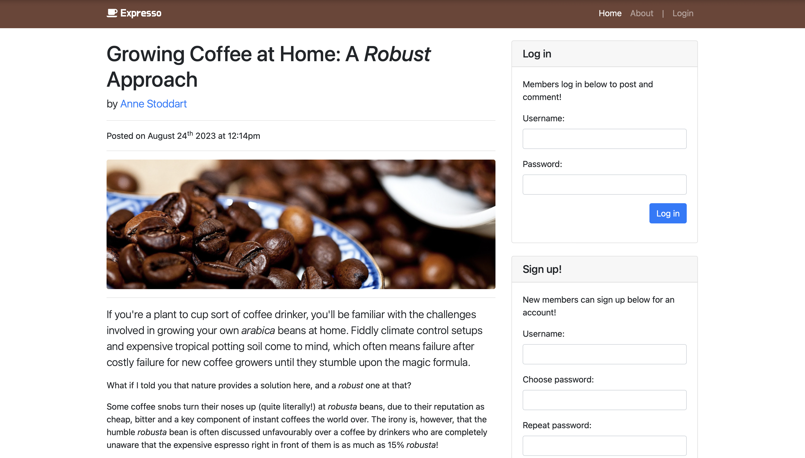

# Password Exposure Exercise

This repository contains a deliberately vulnerable web application exhibiting a simple password exposure vulnerability.

## Purpose



I use this as part of a practical activity in my seminars on cybersecurity for business students. It allows students to get hands-on in conducting a cyberattack without leaving the browser.

## Setup

**Do not deploy this intentionally vulnerable web application on any webserver you don't mind destroying.**

This project is designed to run on a LAMP stack. Simply configure Apache to serve the root of this project. Alternatively, to run the project locally, ensure that PHP 7.0+ is installed and run the following from the project root:

```bash
php -S localhost:8080
```

You'll then be able to access the vulnerable web application at:

```
http://localhost:8080
```

### Deployment

If you want to add this application to your vhosts, a config file is included in the `/vhosts` folder to get you started. 

Rename this, update it with your server name/document root and copy it to `/etc/apache2/sites-available`. Activate it with `a2ensite` and run `letsencrypt` or similar to configure HTTPS automatically.

## Usage

Follow this workflow to conduct the cyberattack on the web application:

1. First, browse to the vulnerable web application and create an account.
2. Log in with your new account and go to your edit profile page.
3. Notice a greyed-out password field on the page. Inspect this element in your browser by right-clicking it and selecting “Inspect element”. Your password is exposed in this field.
4. On your edit profile page, notice the URL in the address bar contains your username. 
5. Track down the website’s administrator by looking through the comments on the site and any user profiles. You'll see the website administrator's username is `admin`.
6. Back on your edit profile page, try swapping your username for the admin’s username in the address bar. This will take you to their edit profile page.
7. Inspect that same password field again. You'll see that it contains the administrator's password.
8. Log out of the account you created, and log in again using the administrator’s username and password. You now have admin access!
9. Notice a new element on the page with the title "Admin reminders". This tells you where the user database is hosted on the server (at `/users.csv`).
10. Try browsing to `/users.csv`, you'll see you're able to download the entire user database.

### Patching the Application

In case the audience is more technical, you may want to show how to patch the vulnerabilities in the application.

To do so, perform a project-wide search for `TODO` to find each code change that needs to be made. Patched code is included as comments.

Apache will need to be reconfigured to disallow the download of the `/users.csv` user database. Do this my renaming `.htaccess.patch` (under the project root) to `.htaccess`. Ensure that your Apache installation [allows .htaccess overrides](https://httpd.apache.org/docs/2.4/howto/htaccess.html) in the web root directory.

## Acknowledgements

The following libraries are used by the project frontend, but are committed to the repository (i.e. not dependency-managed) for ease of deploying the project and resetting it for the next group of students:

* [jQuery v3.5.1](https://jquery.com)
* [Bootstrap v4.5.0](https://getbootstrap.com/docs/4.0/getting-started/introduction/)

The frontend for this project is based on the [StartBootstrap Blog Post Template](https://startbootstrap.com/template/blog-post).

## Copyright and License

Copyright 2023 Saul Johnson. Code released under the [MIT](https://github.com/StartBootstrap/startbootstrap-blog-post/blob/gh-pages/LICENSE) license.
